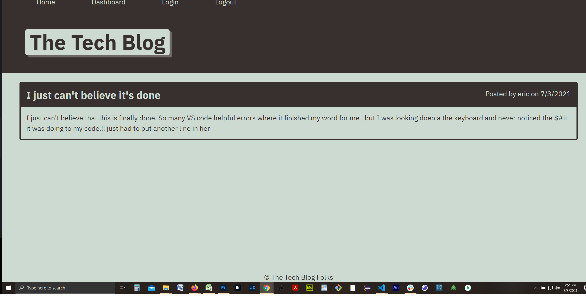

# 14 Model-View-Controller (MVC): Tech Blog
### Apache Liscense

### Description:
  
  Example of software pattern whereby the user, uses information porvided, that in turn maipulate the model, that the users sees.  Typically a 3 interconnected elements.
    * Model: central dynamic data srtucture of app
    * View: user window, client pages
    * Controller: interface between user and Databse.   Logiic pages controlling both view and data manipulations
    
 ### Criteria/ Purpose
 
  * operable UI with links including home page and dashboard
  * signup, login, and logout functionality with appropriate validation, and saved to database
    * Logout re-directs to home page with most recent blog posts
  * member redirectd to dashboard to review, create or delete blog posts
  * Set timer for self logout when page is idel for amount of time (set to 1 minute for testing purposes only)
  * Utilize cookies

### Technologies 

  * Mysql
  *  Sequelize
  * dotenv (npm install dotenv)
  * bcrypt (npm install bcrypt) 
  * express-session (npm install express-session) 
  * connect-session (npm install connect-session-sequelize)
  * axios ( npm install axios)